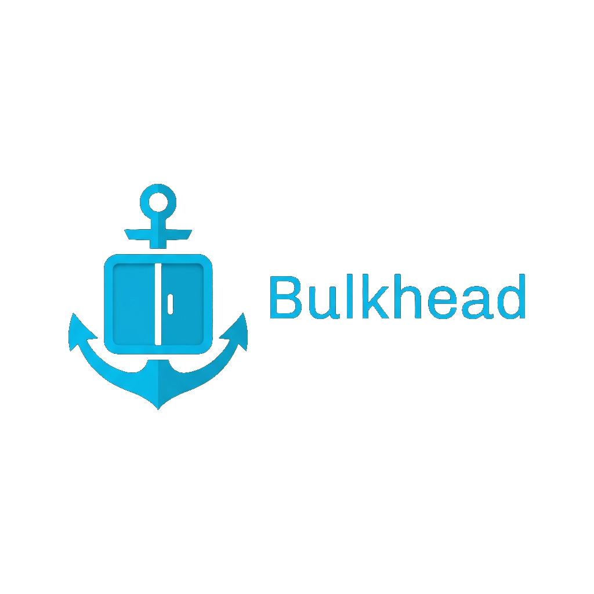
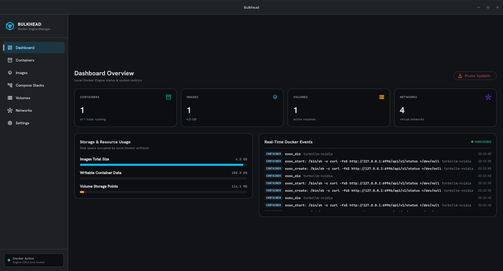
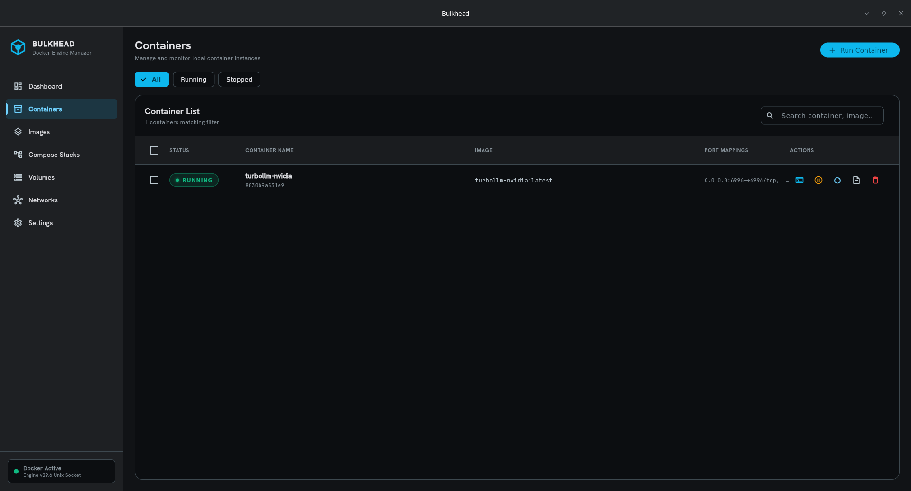
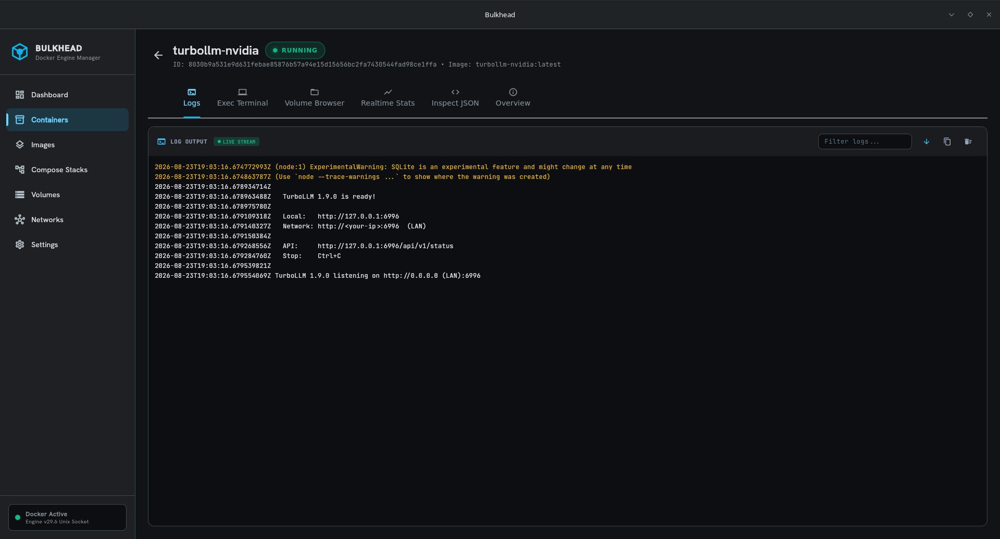
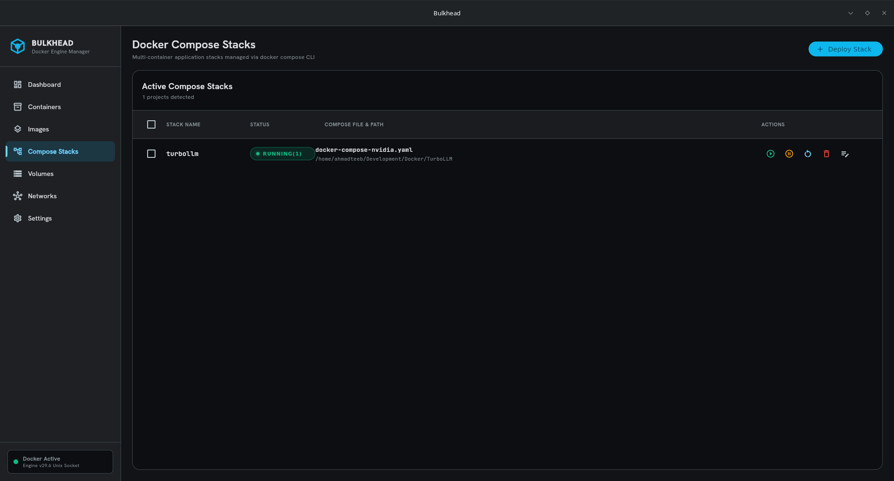
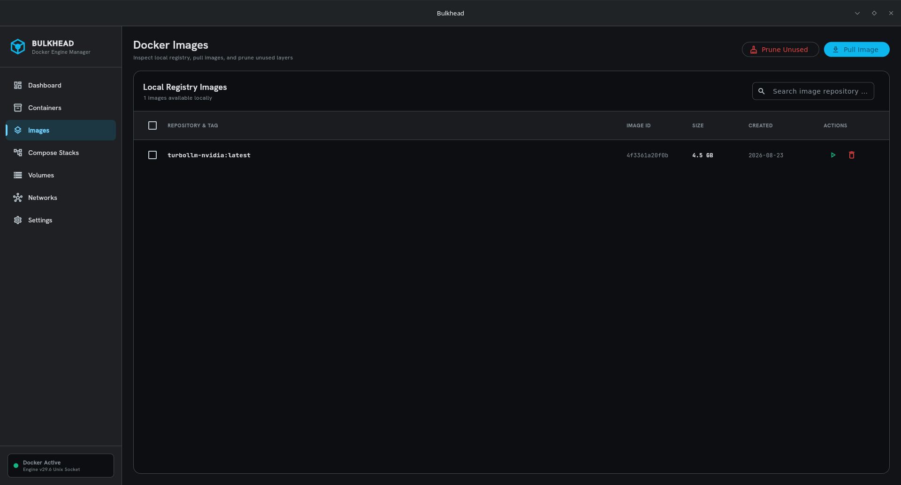
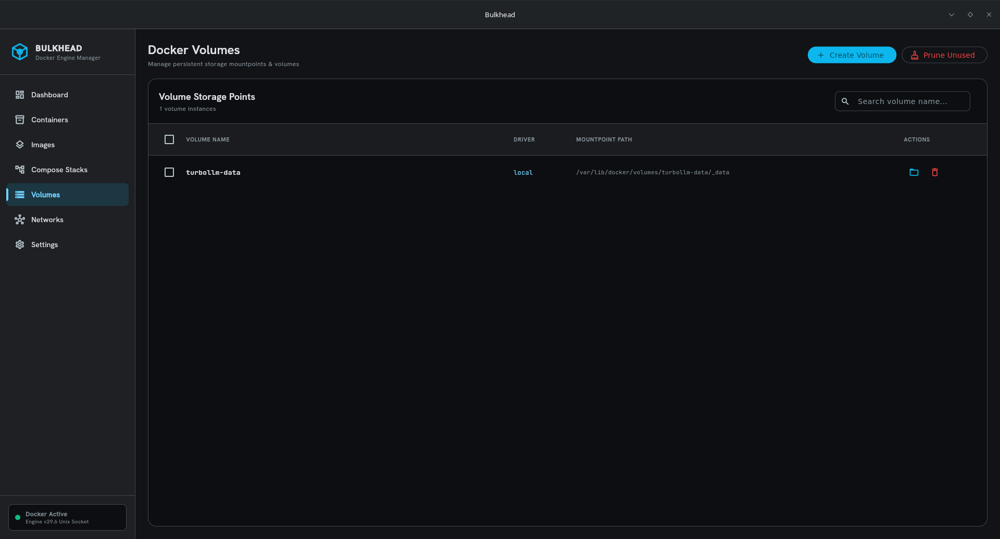
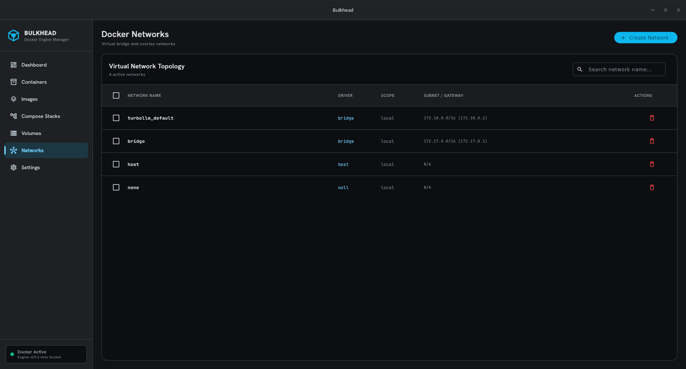
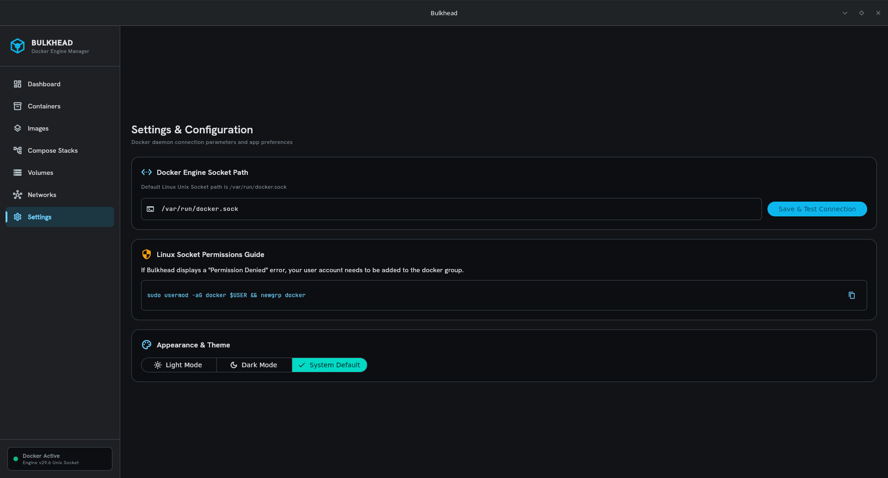

<p align="center">
  
</p>

<h1 align="center">🚀 Bulkhead — Flutter Docker Manager for Linux, macOS & Windows 🐳</h1>

<p align="center">
  <a href="https://flutter.dev"></a>
  <a href="https://archlinux.org"></a>
  <a href="https://www.docker.com"></a>
  <a href="https://riverpod.dev"></a>
  <a href="https://github.com/ahmadteeb/Bulkhead/releases"></a>
</p>

<p align="center">
  <a href="https://www.buymeacoffee.com/ahmadteeb" target="_blank"></a>
</p>

**Bulkhead** is a state-of-the-art desktop Docker Engine manager built with **Flutter Desktop** for **Linux**, **macOS**, and **Windows**. It provides high-performance, real-time container administration, multi-container Compose stack management, local image registry inspection, persistent volume control, virtual network topology visualization, embedded interactive terminal emulation, container volume file browsing with upload/download capabilities, single-click system storage optimization, and automated Over-The-Air (OTA) updates.

---

## ✨ Key Highlights

- ⚡ **100% Real-Time Event-Driven (Zero Polling Overhead)**: Listens continuously to the Docker Engine socket stream (`/events`) to instantly refresh containers, images, volumes, networks, and compose stacks without background timers or screen flickering.
- 🔄 **Automated Over-The-Air (OTA) In-App Updates**: Queries GitHub Releases API at startup to display an **Update Available** pill badge, changelog inspector, and direct download links for `.dmg`, `.zip`, `.deb`, `.rpm`, or `.pkg.tar.zst` packages.
- 🔌 **Direct Native Socket Connection**: Connects directly to local Docker Unix domain sockets (`/var/run/docker.sock`, Docker Desktop / OrbStack / Colima socket paths) or Windows Named Pipes (`\\.\pipe\docker_engine`) using HTTP/1.1 chunked response demuxing.
- 💻 **Embedded Interactive Container Terminal (`xterm`)**: Native terminal emulator with PTY allocation (`script` wrapper), shell selector (`/bin/bash`, `/bin/sh`, `zsh`, `ash`), ANSI escape code stripping, normalized `\r\n` line endings, right-click context menu (**Copy Output**, **Paste Stdin**), and external terminal launcher (macOS Terminal, Windows CMD, Linux terminals).
- 📁 **Container Volume File Browser & File Manager**: Explore container volumes, root file systems, and bind mounts. Features **Back (`<`)** & **Forward (`>`)** directory history navigation, **Upload File** (`docker cp`), and **Download File/Folder** to host system folders. Accessible from container details and the Volumes page.
- 🚀 **Full Docker Compose CLI Integration**: Manage multi-container application stacks (`docker compose up -d`, `down`, `restart`, `down -v --remove-orphans`). Includes a Deploy Stack wizard with an inline `docker-compose.yml` editor.
- 📦 **Multi-Selection & Bulk Actions**: Select multiple containers, images, volumes, or networks with Select-All header checkboxes to perform batch operations (Start, Stop, Restart, Delete).
- 📜 **Dual-Mode Log Telemetry & Demuxing**: Real-time stdout/stderr log streaming supporting both TTY and non-TTY multiplexed stream frames with auto-scrolling and log text copying.
- 🏷️ **Unified Status Badge System**: Standardized status badge colors (`AppColors.success` green for all running stack & container states) and responsive sizing across all screens.
- 🧹 **1-Click Storage Optimization**: Dynamic progress bars calculated from `docker system df` metrics with a single-click **System Prune All** button to reclaim unused disk space.
- 🎨 **Modern Dark & Light Themes**: Dark mode interface designed according to `#111316` surface specifications, paired with crisp `Hanken Grotesk` headings and `JetBrains Mono` code telemetry.

---

## 🔌 Platform Docker Socket Locations

Bulkhead automatically detects and connects to the Docker Engine daemon across all operating systems:

| Platform | Default Socket / IPC Path | Supported Runtimes |
|---|---|---|
| 🐧 **Linux** | `/var/run/docker.sock` | Docker Engine, Podman |
| 🍏 **macOS** | `/var/run/docker.sock`<br>`~/.docker/run/docker.sock`<br>`~/.orbstack/run/docker.sock`<br>`~/.colima/default/docker.sock` | Docker Desktop for Mac,<br>OrbStack, Colima |
| 🪟 **Windows** | `\\.\pipe\docker_engine`<br>`tcp://localhost:2375` | Docker Desktop for Windows,<br>WSL2 Engine |

---

## 🖼️ Feature Tour & Screenshots

### 📊 1. Dashboard Overview
Inspect real-time system metrics, active container slots, `docker system df` storage usage bars, 1-click **Prune System**, and live Docker Engine `/events` stream telemetry.



---

### 📦 2. Containers Management
Monitor and filter container instances (All, Running, Stopped). Perform multi-selection bulk operations or click **Run Container** to deploy new containers with custom port bindings and environment variables.



---

### 💻 3. Embedded Interactive Terminal & Container Telemetry
Deep dive into container telemetry with stdout/stderr log streaming, **Embedded Exec Terminal** (`xterm` with TTY shell selection and right-click copy/paste), **Volume File Browser**, raw Docker inspect JSON view, environment variables, port mappings, and host volume mounts.



---

### 🚀 4. Docker Compose Stacks
Deploy and manage multi-container Compose applications. View service health, stream service terminal logs, edit `docker-compose.yml` directly, and perform full stack lifecycle controls (**Up**, **Down**, **Restart**, **Purge/Delete**).



---

### 🖼️ 5. Local Image Registry
Inspect locally stored Docker images, view repository tags and sizes, execute **Run Container from Image**, perform bulk image deletion, and use the real-time layer progress terminal in **Pull Image**.



---

### 💾 6. Volume Storage Points & File Explorer
Manage persistent storage volumes, inspect host mountpoints and drivers, browse attached volume file systems with **Back/Forward** history and **Upload/Download** options, create new volumes, prune unused volume points, and perform multi-selection deletion.



---

### 🌐 7. Virtual Networks Topology
Visualize virtual bridge, host, overlay, and macvlan networks. Inspect subnets, gateways, attached container IDs, and create custom networks.



---

### ⚙️ 8. System Settings & Connection Configuration
Configure local Docker Unix domain socket paths, test socket permissions, check for software updates, and switch theme modes (**Dark**, **Light**, **System Default**).



---

## 🛠️ Feature Matrix Summary

| Area | Feature & Capability |
|---|---|
| **Real-Time Engine Sync** | 100% event-driven sync via `/events` socket stream; zero polling timers. |
| **Over-The-Air (OTA) Updates** | Auto-checks GitHub Releases API; in-app update notification pill, changelog viewer, direct asset downloads. |
| **Containers** | List, filter, start, stop, restart, remove, multi-select bulk actions, run new container modal. |
| **Interactive Terminal** | `xterm: ^4.0.0` emulator, Linux/macOS PTY allocation (`script`), `/bin/bash`/`/bin/sh`/`zsh` shells, right-click context menu, clean ANSI escape filter, external terminal launcher. |
| **Volume File Manager** | Browse attached container volumes & host mountpoints, Back/Forward navigation stack, Upload host files (`docker cp`), Download files & directories (`docker cp`). |
| **Container Telemetry** | Dual-mode stdout/stderr live logs, raw Inspect JSON viewer, environment variable table, port mapping table. |
| **Compose Stacks** | List stacks, Up/Down/Restart/Delete, Deploy Stack wizard, inline YAML editor, service log stream, unified green status badges. |
| **Images** | Inspect tags/sizes, Pull Image modal with terminal progress, Run Container from Image, Prune unused images. |
| **Volumes** | List mountpoints, create volume modal, remove, multi-select delete, Prune unused volumes, integrated File Browser. |
| **Networks** | List network topology, driver selector (`bridge`, `host`, `overlay`, `macvlan`), subnet/gateway inspector. |
| **Storage Optimization** | Dynamic `docker system df` usage bars, 1-click **Prune System** (`docker system prune -a --volumes`). |

---

## ⚙️ Installation & Getting Started

### 📋 Prerequisites

- **Docker Engine / Docker Desktop**: Installed & running locally.
- **Supported OS**: Linux (Arch, Ubuntu, Debian, Fedora), macOS 11+, Windows 10/11.

---

### 📦 Installation Options

Choose the pre-built installer for your operating system from [GitHub Releases](https://github.com/ahmadteeb/Bulkhead/releases):

#### 🍏 macOS (`.dmg` or `.zip`)
Download `bulkhead-macos-<version>.dmg` or `bulkhead-macos-app.zip` from [GitHub Releases](https://github.com/ahmadteeb/Bulkhead/releases):
1. Open `bulkhead-macos-<version>.dmg`.
2. Drag **Bulkhead.app** into your `/Applications` folder.
3. Launch Bulkhead from Spotlight or Launchpad.

#### 🪟 Windows (`.zip`)
Download `bulkhead-windows-x64.zip` from [GitHub Releases](https://github.com/ahmadteeb/Bulkhead/releases):
1. Extract `bulkhead-windows-x64.zip` to your preferred directory (e.g., `C:\Program Files\Bulkhead`).
2. Run `Bulkhead.exe`.

#### 🌀 Ubuntu / Debian / Linux Mint / Pop!_OS (`.deb`)
Download `bulkhead_<version>_amd64.deb` and install via `apt`:
```bash
sudo apt update
sudo apt install ./bulkhead_1.0.0_amd64.deb
```

#### 🎩 Fedora / RHEL / CentOS / OpenSUSE (`.rpm`)
Download `bulkhead-<version>-1.x86_64.rpm` and install via `dnf` or `rpm`:
```bash
sudo dnf install ./bulkhead-1.0.0-1.x86_64.rpm
# or
sudo rpm -i ./bulkhead-1.0.0-1.x86_64.rpm
```

#### 🏹 Arch Linux / Manjaro / EndeavourOS (`.pkg.tar.zst` or `yay`)
Download `bulkhead-<version>-1-x86_64.pkg.tar.zst` and install via `pacman`:
```bash
sudo pacman -U ./bulkhead-1.0.0-1-x86_64.pkg.tar.zst
```
Or install directly from AUR:
```bash
yay -S bulkhead-bin
```

#### 📦 Portable Linux Zip Archive (`.zip`)
Download `bulkhead-linux-x64.zip`, extract, and run anywhere:
```bash
unzip bulkhead-linux-x64.zip -d ~/bulkhead
cd ~/bulkhead
./bulkhead
```

---

### 🚀 Building & Running from Source

```bash
# 1. Clone the repository
git clone https://github.com/ahmadteeb/Bulkhead.git
cd Bulkhead

# 2. Install Dependencies
flutter pub get

# 3. Run Static Analysis & Unit Tests
flutter analyze
flutter test

# 4. Run Desktop Application locally
flutter run -d linux   # Linux
flutter run -d macos   # macOS
flutter run -d windows # Windows

# 5. Build Release Desktop Bundle with Build Version Arguments
flutter build linux --release --build-name=1.0.0 --build-number=1   # Linux
flutter build macos --release --build-name=1.0.0 --build-number=1   # macOS
flutter build windows --release --build-name=1.0.0 --build-number=1 # Windows
```

---

## 🏗️ Technical Architecture

- **UI Framework**: Flutter Desktop (Linux GTK, macOS Cocoa, Windows Win32 runners).
- **State Management**: Riverpod 2.x (`StateNotifierProvider`, `StreamProvider`, `FutureProvider`).
- **Build Versioning**: Dynamic build number and build name resolution parsed via `package_info_plus` at runtime.
- **OTA Updates**: GitHub Releases API parser (`UpdateNotifier`), in-app update notification pill, changelog inspector (`UpdateDialog`), and direct platform asset launcher.
- **Terminal Emulator**: `xterm: ^4.0.0` with PTY pseudo-terminal allocation (`script -q -c "docker exec -it ..."`).
- **File Manager**: `file_picker` package paired with `docker cp` process execution.
- **Multi-Platform CI/CD Pipelines**: GitHub Actions workflows passing `--build-name=$VERSION --build-number=$BUILD_NUM` and packaging macOS (`.dmg`, `.zip`), Windows (`.zip`), Linux (`.deb`, `.rpm`, `.pkg.tar.zst`, `.zip`), and AUR `PKGBUILD`.
- **Socket I/O**: Custom `DockerSocketConnection` implementing HTTP/1.1 over Unix Domain Sockets and Windows Named Pipes (`\\.\pipe\docker_engine`).
- **Stream Demuxing**: 8-byte multiplexing header demuxer parsing `stdout` (stream type `1`) and `stderr` (stream type `2`) from Docker container log streams.
- **Typography**: Google Fonts (`Hanken Grotesk` headings, `JetBrains Mono` telemetry).

---

## ☕ Support & Donate

If you find **Bulkhead** useful and would like to support its ongoing development, consider buying me a coffee!

<p align="left">
  <a href="https://www.buymeacoffee.com/ahmadteeb" target="_blank"></a>
</p>

---

## 📄 License

Distributed under the MIT License. See `LICENSE` for details.
