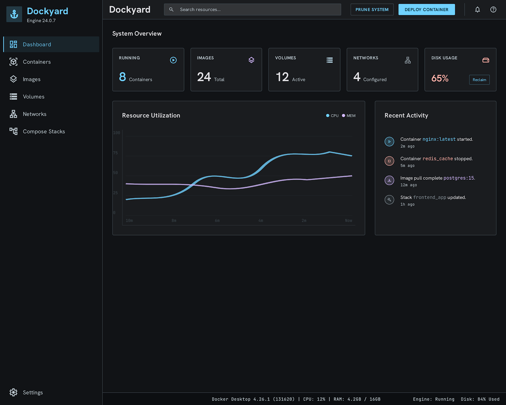
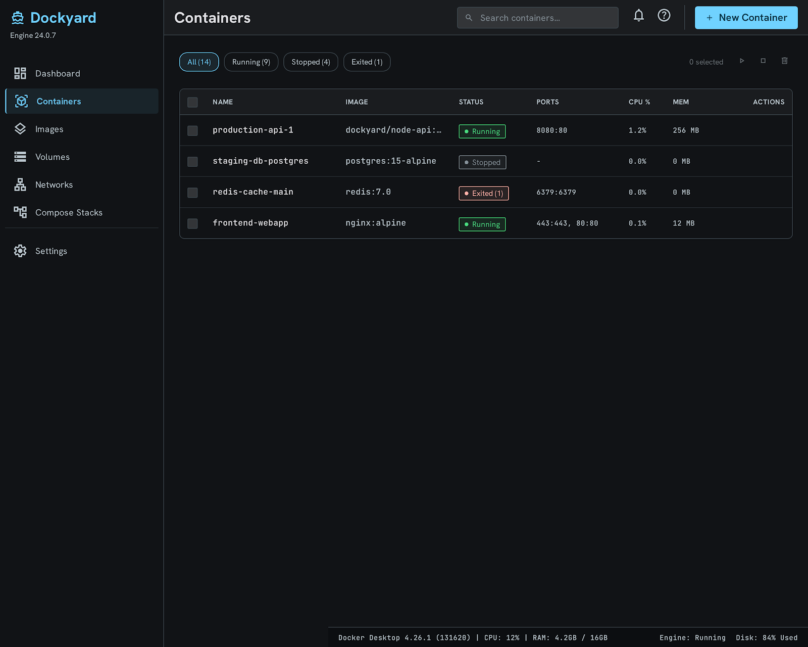
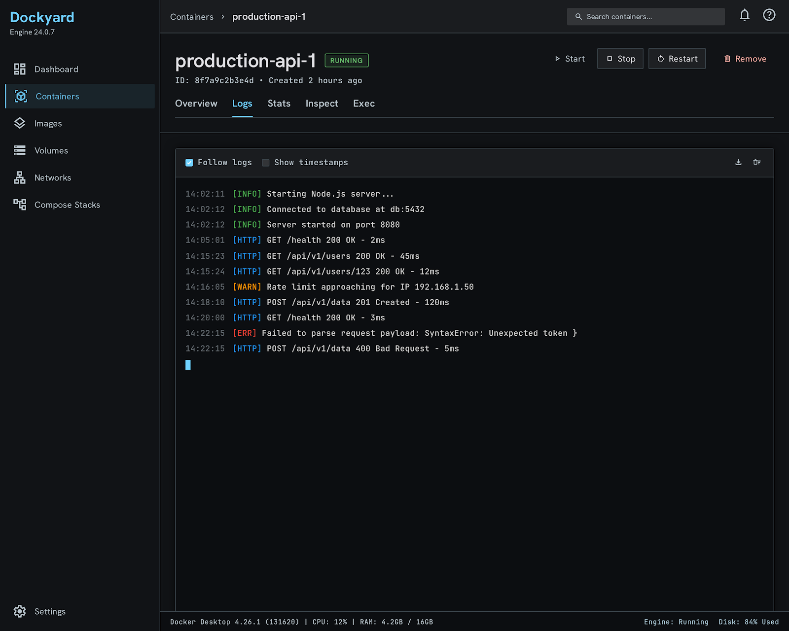
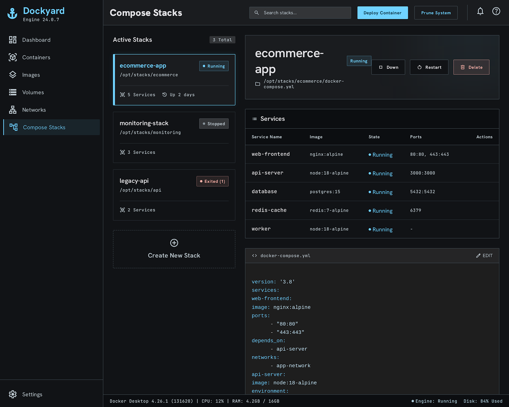
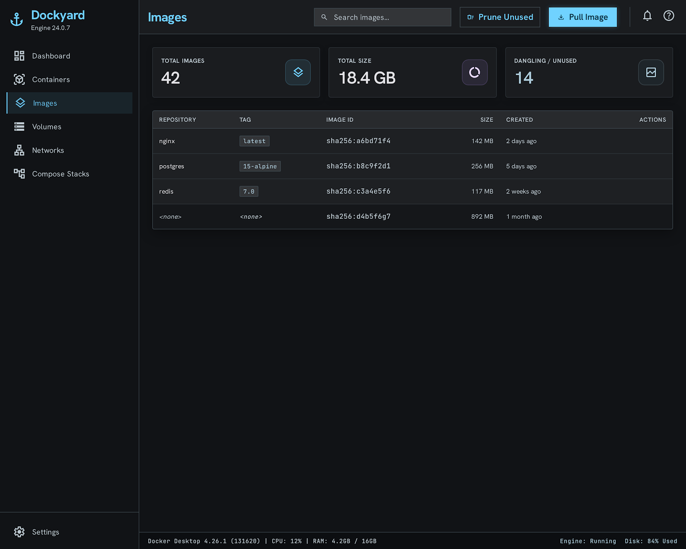
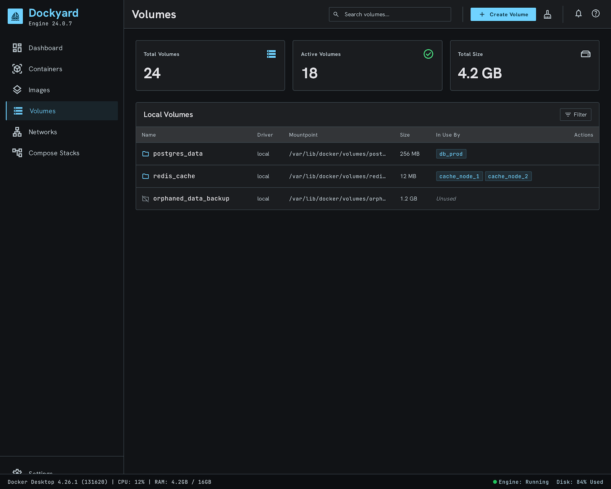
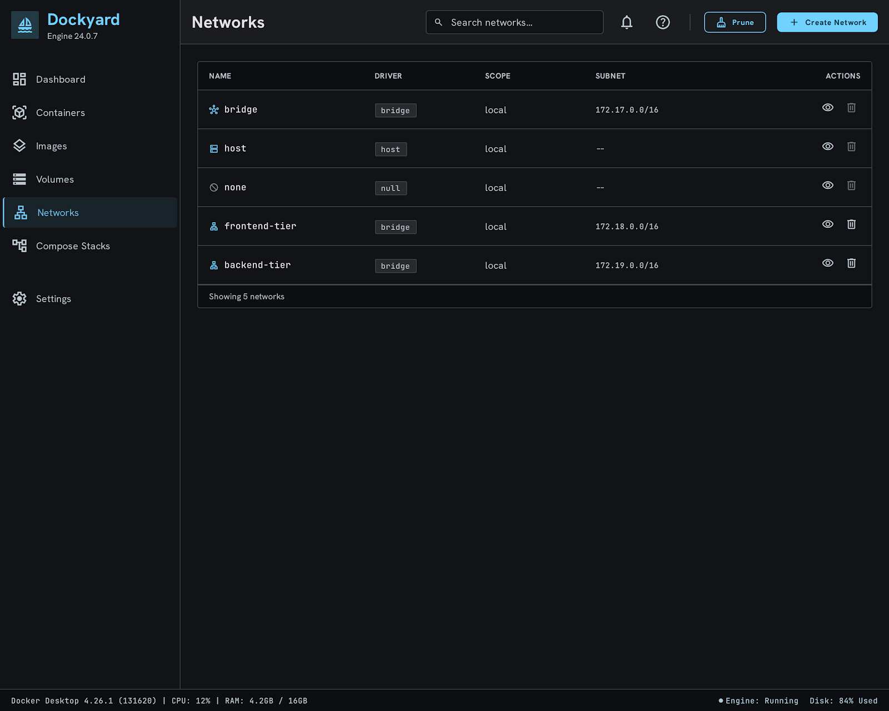
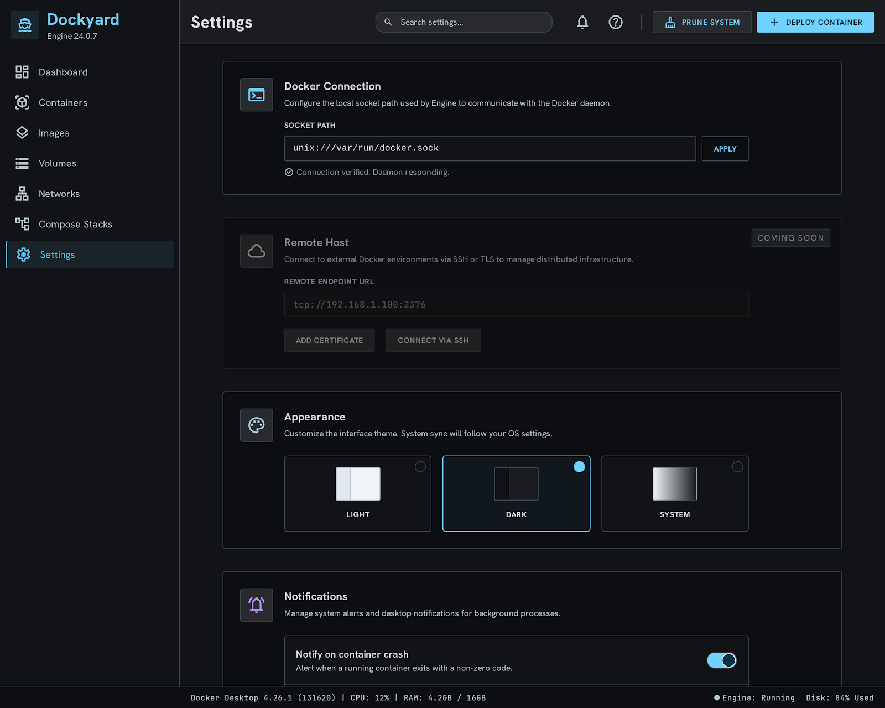

# 🚀 Bulkhead — Flutter Docker Manager for Linux 🐳

[](https://flutter.dev)
[](https://archlinux.org)
[](https://www.docker.com)
[](https://riverpod.dev)
[](#-100-real-time-event-driven-architecture)

**Bulkhead** is a state-of-the-art desktop Linux Docker Engine manager built with **Flutter Desktop**. It provides high-performance, real-time container administration, multi-container Compose stack management, local image registry inspection, persistent volume control, virtual network topology visualization, and single-click system storage optimization.

---

## ✨ Key Highlights

- ⚡ **100% Real-Time Event-Driven (Zero Polling Overhead)**: Listens continuously to the Docker Engine socket stream (`/events`) to instantly refresh containers, images, volumes, networks, and compose stacks without background timers or screen flickering.
- 🔌 **Direct Native Unix Socket Connection**: Connects directly to `/var/run/docker.sock` over Unix domain sockets using HTTP/1.1 chunked response demuxing, bypassing external daemon proxy layers.
- 🚀 **Full Docker Compose CLI Integration**: Manage multi-container application stacks (`docker compose up -d`, `down`, `restart`, `down -v --remove-orphans`). Includes a Deploy Stack wizard with an inline `docker-compose.yml` editor.
- 📦 **Multi-Selection & Bulk Actions**: Select multiple containers, images, volumes, or networks with Select-All header checkboxes to perform batch operations (Start, Stop, Restart, Delete).
- 🧹 **1-Click Storage Optimization**: Dynamic progress bars calculated from `docker system df` metrics with a single-click **System Prune All** button to reclaim unused disk space.
- 🎨 **Modern Dark & Light Themes**: Dark mode interface designed according to `#111316` surface specifications, paired with crisp `Hanken Grotesk` headings and `JetBrains Mono` code telemetry.

---

## 🖼️ Feature Tour & Screenshots

### 📊 1. Dashboard Overview
Inspect real-time system metrics, active container slots, `docker system df` storage usage bars, 1-click **Prune System**, and live Docker Engine `/events` stream telemetry.



---

### 📦 2. Containers Management
Monitor and filter container instances (All, Running, Stopped). Perform multi-selection bulk operations or click **Run Container** to deploy new containers with custom port bindings and environment variables.



---

### 🔍 3. Container Details & Real-Time Logs Stream
Deep dive into container telemetry with demuxed stdout/stderr log streaming, raw Docker inspect JSON payload view, environment variables, port mappings, and host volume mounts.



---

### 🚀 4. Docker Compose Stacks
Deploy and manage multi-container Compose applications. View service health, stream service terminal logs, edit `docker-compose.yml` directly, and perform full stack lifecycle controls (**Up**, **Down**, **Restart**, **Purge/Delete**).



---

### 🖼️ 5. Local Image Registry
Inspect locally stored Docker images, view repository tags and sizes, execute **Run Container from Image**, perform bulk image deletion, and use the real-time layer progress terminal in **Pull Image**.



---

### 💾 6. Volume Storage Points
Manage persistent storage volumes, inspect host mountpoints and drivers, create new volumes, prune unused volume points, and perform multi-selection deletion.



---

### 🌐 7. Virtual Networks Topology
Visualize virtual bridge, host, overlay, and macvlan networks. Inspect subnets, gateways, attached container IDs, and create custom networks.



---

### ⚙️ 8. System Settings & Connection Configuration
Configure local Docker Unix domain socket paths (`/var/run/docker.sock`), test socket permissions, and switch theme modes (**Dark**, **Light**, **System Default**).



---

## 🛠️ Feature Matrix Summary

| Area | Feature & Capability |
|---|---|
| **Real-Time Engine Sync** | 100% event-driven sync via `/events` socket stream; zero polling timers. |
| **Containers** | List, filter, start, stop, restart, remove, multi-select bulk actions, run new container modal. |
| **Container Inspection** | Demuxed live logs, raw inspect JSON, ENV variables, Port bindings, Mountpoints. |
| **Compose Stacks** | List stacks, Up/Down/Restart/Delete, Deploy Stack wizard, inline YAML editor, service log stream. |
| **Images** | Inspect tags/sizes, Pull Image modal with terminal progress, Run Container from Image, Prune unused images. |
| **Volumes** | List mountpoints, create volume modal, remove, multi-select delete, Prune unused volumes. |
| **Networks** | List network topology, driver selector (`bridge`, `host`, `overlay`, `macvlan`), subnet/gateway inspector. |
| **Storage Optimization** | Dynamic `docker system df` usage bars, 1-click **Prune System** (`docker system prune -a --volumes`). |

---

## ⚙️ Installation & Getting Started

### 📋 Prerequisites

- **OS**: Linux (Arch Linux, Ubuntu 22.04+, Debian, Fedora, Manjaro).
- **Docker Engine**: Installed & running locally (`/var/run/docker.sock`).
- **Permissions**: Current user must belong to the `docker` usergroup:
  ```bash
  sudo usermod -aG docker $USER
  newgrp docker
  ```
- **Flutter SDK**: 3.10+ (for building from source).

---

### 🚀 Building & Running from Source

```bash
# 1. Clone the repository
git clone https://github.com/ahmadteeb/Bulkhead.git
cd Bulkhead

# 2. Install Dependencies
flutter pub get

# 3. Run Static Analysis & Unit Tests
flutter analyze
flutter test

# 4. Run Desktop Application locally
flutter run -d linux

# 5. Build Release Linux Desktop Bundle
flutter build linux --release
```

---

## 🏗️ Technical Architecture

- **UI Framework**: Flutter Desktop (Linux X11/Wayland GTK runner).
- **State Management**: Riverpod 2.x (`StateNotifierProvider`, `StreamProvider`, `FutureProvider`).
- **Socket I/O**: Custom `DockerSocketConnection` implementing HTTP/1.1 over Unix Domain Sockets (`Socket.connect(InternetAddress('/var/run/docker.sock', InternetAddressType.unix), 0)`).
- **Stream Demuxing**: 8-byte multiplexing header demuxer parsing `stdout` (stream type `1`) and `stderr` (stream type `2`) from Docker container log streams.
- **Typography**: Google Fonts (`Hanken Grotesk` headings, `JetBrains Mono` telemetry).

---

## 📄 License

Distributed under the MIT License. See `LICENSE` for details.
